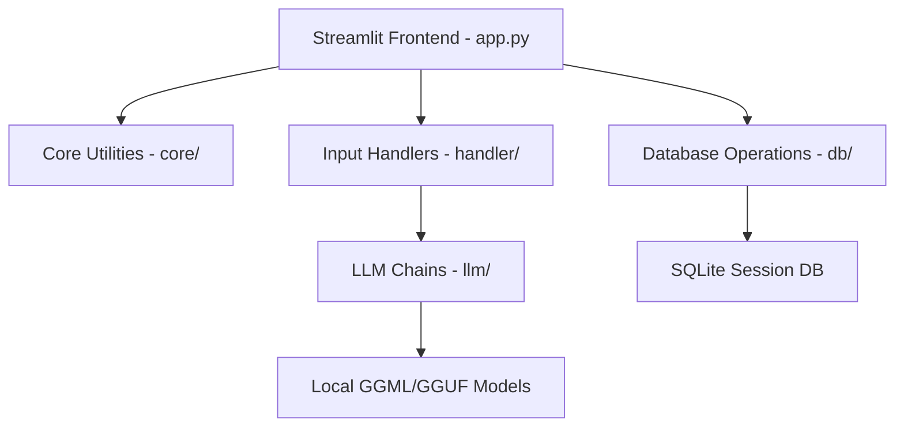
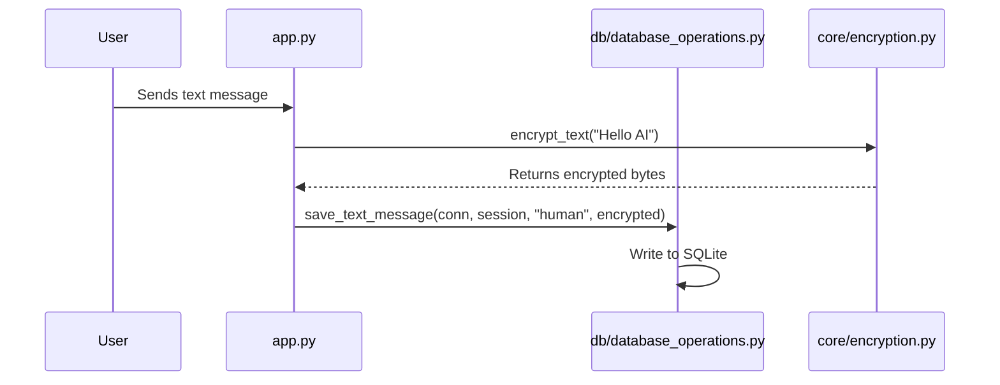

# Converso Architecture Guide

This guide details the system architecture, component design, and data flows of Converso, a local multi-modal AI chatbot utilizing LLaVa and Mistral 7B.

## Component Overview

Converso is composed of five core modules:

### 1. Frontend (`app.py`)
Built with Streamlit, handling the visual components, chat containers, sidebar widgets, and rendering of chat messages (text, image, audio).

### 2. Core Module (`core/`)
- `utils.py`: Configuration loader (`load_config`), timestamp utilities, and json utilities.
- `encryption.py`: Symmetric AES-128 Fernet encryption for data at rest.
- `image_cache.py`: Low-latency memory cache for image processing.
- `model_loader.py`: Handles model loading and memory limits.

### 3. Database Operations (`db/`)
- `database_operations.py`: Manages message lifecycle in SQLite, session renaming, deletion, and message storage.

### 4. Input Handlers (`handler/`)
- `image_handler.py`: Preprocesses images and interfaces with the multi-modal model.
- `audio_handler.py`: Manages voice recording transcription (Whisper).
- `pdf_handler.py`: RAG pipeline utilizing vector search (ChromaDB) to inject context into prompts.

### 5. LLM Chains (`llm/`)
- `llm_chains.py`: Orchestrates LangChain chains, memory buffers, and mock modes for offline testing.

## Data Storage & Encryption Flow

All messages (text, audio, image) are encrypted before writing to the SQLite database.

